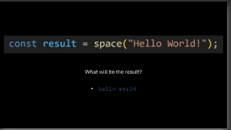
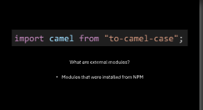

## Modules

- Allows the code in a JavaScript file to be used in other JavaScript files.
- Uses the keywords export and import.

### Keyword export

`export function myFunction();`

- Makes code usable in other JavaScript files.

#### Example:

```javascript
export function myModule() {
  console.log("This is a module.");
}
```

### Keyword import

`import { myFunction } from " ./module.js";`

- Uses code from another JavaScript file.
- The ./ is the relative path that means the current folder.
-

#### SYNTAX:

- use a pair of curly braces.
- insert the module name.
- use the keyword from.
- include the path of the file in quotes "".
- use a dot and a forward slash to represent the current folder.
- RELATIVE PATH NOTATION uses the dot and forward slash.
- the type attribute must be set to "module".
  `<script src="./modules.js" type="module"></script>`
  `<script src="./modulesTest.js" type="module"></script>`

#### Example:

```javascript
import { outputModule } from "./utility-functions.js";
function moduleExample() {
  debugger;
  myModule();
  outputModule("Hello World!");
}
```

### Window Module

`window.moduleExample = moduleExample;`

- It's only necessary to attach a module to the window object if the module will be used by the HTML file.
- moduleExample is directly used by the HTML file.
- outputModule is not directly used by the HTML.
- The property name doesn't need to match the module name.
- The module must be called by the name attached to the window object.

### Function Hoisting

`window.moduleExample = moduleExample;`

- JavaScript invisibly brings function definitions to the top.
- Functions can be called before they are defined in a file.

### Object Oriented Programming

`const column = new Column("my content");`

- Create objects that bundle related data and functions together.
- The keywords `class`, `new`, and `this` are used to achieve OOP.

### Folder Structure

```
> controllers
> modules
> utils
```

- `modules` Contains functions specific to the project.
- `utils` Contains functions that can be used by other projects.
- `controllers` Contains functions that control the flow of how modules are used.
- Usually only 1 function or class per file.

### Relative file paths

- `./` Look in the current folder
- `../` Go back one folder

### Module errors

#### Uncaught syntax error: Cannot use import statement outside a module

- `type="module"` is missing from the `<script>` tag:

#### GET http:://localhost:8081/utils/output net::ERR_ABORTED 404 (Not Found)

- The import command has the incorrect path; it is missing the `.js` extension or the file name does not match the file in the folder structure.

### Automatically import modules in VS Code

1. Open the module file.
2. Open the file that will import the module.
3. Start typing the module name.
4. Select the module from the popup list.

### How to find the class of an object

1. Use the debugger to explore the object.
2. The class is in the `[[Prototype]]`.

### Node.js

- A program that can run JavaScript files in the terminal.
- Node.js is JavaScript for the backend and slightly different than for the front end
- To run a file, type `node` and then the name of the file: `node greetingTest.js`.

### Install node.js

1. Go to https://nodejs.org.
2. Download Node.js.
3. Install Node.js with default options.

### Run JavaScript using Node.js

`node greeting.js`
`node ./controllers/greetingTest.js`

### Named exports and imports

`export function greeting(name)`
`import { } from ""`

- Must use curly braces.
- Must use the exact module name.
- There can be multiple named exports in a single file.

1. Make a greeting function that accepts a name and logs a greeting.
2. Import the greeting function and use it.
3. Run the module with `node` and observe the error.
4. Or use relative path notation: `node ./controllers/greetingTest.js`

### Default imports and exports

greeting.js
`export default function greeting("name");`

greetingTest.js
`import sayHiTo from "../modules/greeting.js";`

- Does not use curly braces.
- Can use a different name than the module.
- Add the `default` keyword to the export.
- There can only be 1 default export per file.

### NPM

- Node Package Manager
- A program that comes with Node.js.
- Let's Node.js use modules.
- npm can manage dependencies.
- npm can (in one command line) install all the dependencies of a project.
- Also use to install code from other JavaScript programmers.
- https://npmjs.com

### How to configure Node.js for modules

- Initialize NPM.
- `npm init`
- Select the default options by pressing ENTER.
- VS Code creates the package.json file.

1. Initialize npm for the project.
2. Review JSON in package.json.
3. Add "type": "module" to package.json.
4. Run the greeting module.

### {} package.json

- Configuration file for Node.js.
- Installed node modules (external) are listed.
- Generated by npm init.
- Must be initialized and installed fresh for every new project.

### Node modules

>

`>npm install to-no-case` - hello world
`>npm install to-camel-case` = helloWorld
`>npm install to-space-case` - hello world

- Reusable code that can be installed with NPM.
- NPM commands start with `npm`.
- Add the `instanll` command to install a module from npmjs.org.
- May not be compatible with the browser.

### Require function

`var toNoCase = require('to-no-case')`

```javascript
const result = toNoCase("Hello World1");
```

`var camel = require('to-camel-case')`

- The old way of iporting modules.
- Not compatible with web browsers even though it's JavaScript.
- Can be replaced with default import syntax: `import toNoCase from "to-no-case";` or `import camel from "to-camel-case";`

### Internal modules

`import sayHiTo from "../modules/greeting.js";`

- Modules that were created in the project.
- Must be imported with relative path notation.

### External modules

`import toNoCase from "to-no-case";`
>
- Modules that were installed from NPM.
- Must be imported with their package name.

### npx

- Node Package execute
- Runs node moodules in the terminal.
- Compes bundled with NPM.
- Example: `npx webpack`.

### Error messages

#### Uncaught TypeError: Failed to resolve module specifier "to-space-case". 12/17/24
>**

- Happens when using a node (external) module with a browser because there is no relative path

#### Uncaught SyntaxError: The requested module '' does not provide an expoet named 'defaut' 12/17/24

#### Uncaught ReferenceError: require is not defined 12/7/24 2:44:28
